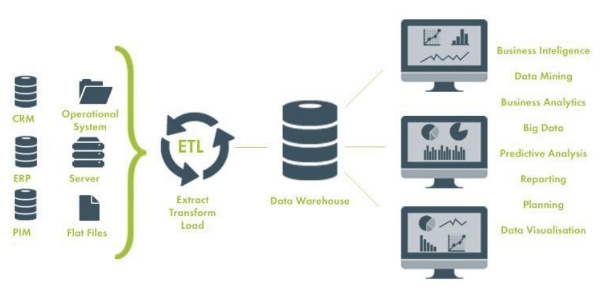

<div align="center">
  <h1>Introducción al Pensamiento Computacional con Python</h1>
</div>

<div align="center"> 
  
</div>

# Introducción al documento

El contenido de este documento esta basado en el curso del mismo nombre dictado por [David Aroesti](https://github.com/jdaroesti) en [Platzi](https://platzi.com/r/karlbehrens/).

# Tabla de contenido
- [Introducción](#Introducción)
    - [¿Qué es la Ciencia e Ingeniería de Datos?](#¿Qué-es-la-Ciencia-e-Ingeniería-de-Datos?)
    - [Roles](#Roles)
    - [Instalación de Anaconda](#Instalación-de-Anaconda)
    - [Comandos de Anaconda](#Comandos-de-Anaconda)
    - [Jupyter Notebooks](#Jupyter-Notebooks)
    - [Profundizando en tipos de datos](#Profundizando-en-tipos-de-datos)
    - [Fuentes de datos](#Fuentes-de-datos)
    - [ETL](#ETL)
- [Web scraping](#Web-scraping)
    - [Introducción a las tecnologías web](#Introducción-a-las-tecnologías-web)
    - [Realizar solicitudes HTTP con Python](#Realizar-solicitudes-HTTP-con-Python)
    - [¿Cómo trabajar con un documento HTML?](#¿Cómo-trabajar-con-un-documento-HTML?)
    - [Del scraping al crawling](#Del-scraping-al-crawling)

# Introducción

## ¿Qué es la Ciencia e Ingeniería de Datos?

La **Ciencia de Datos** es la disciplina que se encarga de extraer conocimiento de los datos disponible. Casi siempre cuando te realizas una pregunta sobre datos estas fuentes se encuentran escondidas, ocultas o de difícil acceso. A nuestro alrededor hay datos en tu computadora, mesa, reloj, etc.

**Los datos están por todas partes.**

La Ciencia de datos es multidisciplinaria. A diferencia de muchos otros ámbitos profesionales dentro del mundo de la tecnología cuando hablamos de un científico de datos es una persona que sabe de matemáticas, ingeniería de software y sabe de negocios.

Se apoya en la _Computer science_, Matemáticas (Regresiones e Inferencias), y también se auxilia de:

- Bases de Datos.
- Análisis de texto y procesamiento de lenguaje natural.
- Análisis de redes.
- Visualización de datos.
- Machine learning e Inteligencia Artificial.
- Análisis de señales digitales.
- Análisis de datos en la nube (Big Data).

## Roles

Existen por lo menos tres diferentes roles para tener un _pipeline_ completo de ciencia de datos. Este curso trata sobre el primer rol:

- **Data engineer:** Se encarga de obtener los datos, limpiarlos y estructurarlos para posterior análisis, crear _pipelines_ de análisis automatizado, utilización de herramientas en la nube, análisis descriptivo de los datos.

- **Data scientist:** Una vez tiene los datos se encarga de generar el análisis matemático de ellos, encontrar las relaciones entre las variables, las correlaciones, las causas y por último genera los modelos predictivos y prescriptivos.

- **Machine Learning engineer:** Se encarga de llevar las predicciones a escala, de subirlos a la nube y allí generar muchas predicciones. Se encarga de mantener la calidad del modelo.

## Instalación de Anaconda

Para esta guía haremos uso de [Anaconda](https://www.anaconda.com/), la cual es una instalación de Python que ya trae preinstalado todos los paquetes necesarios para tu labor en la Ciencia de Datos, tiene más de **1400 paquetes**. Nos permite configurar ambientes virtuales para poder utilizar diferentes versiones de nuestros paquetes. Procura instalar [Anaconda](https://www.anaconda.com/) en tu computadora.

## Comandos de Anaconda

### Versión de Anaconda

Luego de haber instalado [Anaconda](https://www.anaconda.com/) en nuestra máquina, abriremos la terminal y veremos que anaconda este instalado ejecutando el comando:

```
conda --version
```

Y veremos la versión de [Anaconda](https://www.anaconda.com/) que tenemos instalado.

<div align="center"> 
  
</div>

### Desactivar ambiente de Anaconda

Si lograste observar bien nuestra terminal esta inicia con un **ambiente de anaconda** de forma **predeterminada.** Si la queremos **desactivar** lo haremos con el siguiente comando.

```
conda deactivate
```

<div align="center"> 
  
</div>

### Activar ambiente de Anaconda

Para volver **activar** el ambiente ejecutamos.

```
conda activate
```

<div align="center"> 
  
</div>

### Comandos de Conda

Para listar los **comandos** de conda utilizaremos:

```
conda --help
```

<div align="center"> 
  
</div>

### Listar paquetes instalados

Podemos listar todos los **paquetes instalados** en nuestra computadora.

```
conda list
```

<div align="center"> 
  
</div>

### Crear ambientes virtuales

Es una buena práctica crear un ambiente virtual para cada proyecto. Para ello Anaconda ya cuenta con un comando para crear ambientes.

```
conda create --name nombre_ambiente libreria_1 libreria_2 libreria_n
```

<div align="center"> 
  
</div>

<div align="center"> 
  
</div>

### Activar ambientes virtuales

Luego de crear el **ambiente virtual** para nuestro proyecto, lo podemos **activar** haciendo referencia a su nombre.

```
conda activate nombre_ambiente
```

<div align="center"> 
  
</div>

### Desactivar ambientes virtuales

Para **desactivar** ambiente virtual ejecutamos el siguiente comando.

```
conda deactivate
```

<div align="center"> 
  
</div>

### Listar ambiente virtuales

Si queremos **listar** todos los ambientes virtuales creados en nuestra computadora.

```
conda env list
```

<div align="center"> 
  
</div>

### Eliminar ambiente virtual

Si deseamos **eliminar** un ambiente con todos sus paquetes ejecutamos el siguiente comando.

```
conda remove --name nombre_ambiente --all
```

## Jupyter Notebooks

Algo interesante que tenemos con Anaconda es que nos trae Jupyter Notebooks.

Jupyter Notebooks es un entorno de programación en el cual podemos mezclar ejecución de código en vivo, visualizaciones y añadir markdown.

### Inicializar Jupyter Notebook

Para inicializar un servidore de Juper Notebooks ejecutamos en consola:

```
jupyter notebook
```

Esto nos abrira una pantalla en nuestro navegador con la aplicación. Si no lo abre de forma automática puedes copiar la dirección url que te entrega la consola.

<div align="center"> 
  
</div>

<div align="center"> 
  
</div>

### Crear Notebook

Para crear un notebook simplemente vamos a navegar al directorio donde queramos guardar nuestro proyecto, y en **new** creamos nuestro proyecto en **Python 3.**

<div align="center"> 
  
</div>

Se nos abrira una nueva pestaña con el nuevo _notebook_, y lo primero que haremos es cambiar su nombre en la parte superior.

<div align="center"> 
  
</div>

### Ejecutar código

Para ejecutar el código que vamos escribiendo en nuestras celdas, simplemente tecleamos:

- `shift + enter`: Para agregar una nueva celda al final.
- `ctrl + enter`: Para solamente ejecutar la celda.

### Navegar

Para navegar por el notebook simplemente tecleamos `esc` y con ello el contorno de nuestra selección cambiara a azul. Ahora puedes hacer uso de las teclas de dirección arriba y abajo para navegar por el notebook.

Si quieres volver a entrar al modo de escritura simplemente apretas `enter`.

### Configuración tipo celda

Para configurar el tipo de celda entramos al modo de navegación con `esc` y con la tecla:

- `c`: La celda sera de tipo **código.** En este tipo escribiremos nuestro código para el proyecto.
- `m`: La celda sera de tipo **markdown.** Aquí escribiremos los comentarios, cabeceras, etc.
- `r`: La celda sera de tipo **Raw NBConvert.** Se utiliza para mantener código que no queremos ejecutar.

### Paleta de comandos

Con Jupyter Notebook podemos acceder a la paleta de comandos y los shortcuts que tiene. Para ello entramos al modo de navegación con `esc` y luego tecleamos `p`.

<div align="center"> 
  
</div>

## Profundizando en tipos de datos

Los datos vienen en muchas formas y estas formas las podemos clasificar de diferentes maneras, permitiéndonos poder aplicar técnicas distintas a cada uno de los tipos de datos.

- **Primitivos:** int, str, bool, float, hex, oct, datetime, objetos especiales.
- **Estructurados:** Bases de datos, Data warehouses
- **Semi estructurados:** json APIs, Datos tabulares (csv, excel)
- **No estructurados:** HTML, Texto libre, Curriculum vitaes, Imágenes, audio, social media, Datos científicos
- **Cualitativos vs cuantitativos**
- **Tiempo real vs históricos**

<div align="center"> 
  
</div>

## Fuentes de datos

Las **fuentes de datos** son el origen de donde podemos obtener la información para realizar nuestros proyectos. Estas fuentes pueden ser:

- **Web:** Es una mina enorme con datos financieros, de startups, del clima, precipitación fluvial, astronómicos, de negocios, etc.
- **APIs:** Endpoints que viven en la web y nos devuelven JSON. Por ejemplo, la API de twitter, google, facebook.
- **User Analytics:** Son el comportamiento del usuario dentro de nuestra aplicaciones, algo similar a los que nos ofrece Google Analytics.
- **IoT:** Se ha vuelto una mina espectacular en los últimos años. Como automóviles.

Existen muchas otras fuentes aun donde podemos obtener datos.

## ETL

**Extract:** Es el proceso de lectura de datos de diversas fuentes
- Base de datos
- CRM
- Archivos CSV
- Datasets públicos

**Transform:** En este momento cuando nosotros tenemos que transformar los datos, tenemos que identificar datos faltantes o datos erróneos o una edad negativa. En esta etapa donde tenemos que identificar todos los problemas y solucionarlos.
- Limpieza
- Estructurado
- Enriquecimiento.

**Load:** Una vez transformados debemos insertarlos en el data warehouse
- Depende del tipo de solución que se haya escogido

<div align="center"> 
  
</div>

# Web scraping

## Introducción a las tecnologías web

Las tecnologías web en principio podemos pensarlas como el internet, pero el internet es mucho más grande, es la red de redes, la forma en la que millones de computadores se conectan entre ellas para transferirse información.

El internet también se compone de otros pedazos como telefonía(voip), mail(pop3, imap), compartir archivos(ftp). El internet es una red que une varias redes públicas, privadas, académicas, de negocios, de gobiernos, etc.

La **web** específicamente es un espacio de información en el cual varios documentos(y otros recursos web) se pueden acceder a través de URLs y vínculos(links). La comunicación se da a través del protocolo **HTTP.**

Elementos básicos de la web:

- **HTML:** nos da la estructura de la información. Es un lenguaje para anotar pedazos de información para que el navegador o otros tipos de programa puedan interpretar que tipo de información se encuentra ahí.
- **CSS:** nos permite darle colores, arreglar el texto y añadir diferentes elementos de presentación.
- **Javascript:** nos permite añadir interactividad y cómputo a nuestra web.
- **JSON:** Simplemente es una forma de transmitir datos entre servidores y clientes. Es la forma estándar en las que en la web y las aplicaciones se comunican con los servidores backend.

## Realizar solicitudes HTTP con Python

Para poder experimentar con la web necesitamos un método programático para solicitar URLs y obtener un HTML, y para esto existe en _Python_ la librería **requests**, el cual nos permitira generar solicitudes a la web dentro de _Python_ y utilizar los diferentes verbos HTTP. Normalmente utilizaremos el método **GET** porque vamos a traer datos.

Para realizar una solicitud utilizaremos el método `requests.get('url')` y nos devolverá un objeto response.

Todas las solicitudes HTTP tienen metadatos para que los diferentes sistemas y computadoras puedan entender de qué va la solicitud.

Este ejercicio lo puedes realizar dentro de _Jupyter Notebook_.

```py
# Importamos la librería requests
import requests

# Realizamos una petición GET a la URL definida, y el objeto
# requests con la respuesta la guardamos en nuestra variable response.
response = requests.get('https://platzi.com')
```

```py
# Con el siguiente comando veremos la documentación del objeto en response.
response?

# Y se desplegara la información
Type:        Response
String form: <Response [200]>
File:        /opt/anaconda3/envs/platzi_data/lib/python3.8/site-packages/requests/models.py
Docstring:  
The :class:`Response <Response>` object, which contains a
server's response to an HTTP request.
```

```py
# Si queremos ver como esta implementado el objeto response dentro de Python.
response?? 

# Se desplegara la información de la clase y sus métodos.
Type:        Response
String form: <Response [200]>
File:        /opt/anaconda3/envs/platzi_data/lib/python3.8/site-packages/requests/models.py
Source:     
class Response(object):
    """The :class:`Response <Response>` object, which contains a
    server's response to an HTTP request.
    """

    __attrs__ = [
        '_content', 'status_code', 'headers', 'url', 'history',
        'encoding', 'reason', 'cookies', 'elapsed', 'request'
    ]

    def __init__(self):
        self._content = False
        self._content_consumed = False
...
```

```py
# Si solo quieres imprimir los métodos de la clase lo puedes hacer con:
print(dir(response))

# Y veremos todos sus métodos.
['__attrs__', '__bool__', '__class__', '__delattr__', '__dict__', '__dir__', '__doc__', '__enter__', '__eq__', '__exit__', '__format__', '__ge__', '__getattribute__', '__getstate__', '__gt__', '__hash__', '__init__', '__init_subclass__', '__iter__', '__le__', '__lt__', '__module__', '__ne__', '__new__', '__nonzero__', '__reduce__', '__reduce_ex__', '__repr__', '__setattr__', '__setstate__', '__sizeof__', '__str__', '__subclasshook__', '__weakref__', '_content', '_content_consumed', '_next', 'apparent_encoding', 'close', 'connection', 'content', 'cookies', 'elapsed', 'encoding', 'headers', 'history', 'is_permanent_redirect', 'is_redirect', 'iter_content', 'iter_lines', 'json', 'links', 'next', 'ok', 'raise_for_status', 'raw', 'reason', 'request', 'status_code', 'text', 'url']
```

## ¿Cómo trabajar con un documento HTML?

Para manipular documentos HTML, en Python utilizamos BeautifulSoup
- BeautifulSoup permite analizar gramaticalmente (“parsear”) el documento HTML para que lo podamos manipular programáticamente y podamos consultarlo
- El documento se convierte en un árbol de nodos
- Le realizamos consultas con selectores de CSS

```py
soup = bs4.BeautifulSoup(response.text, 'html.parser')
soup.select('body')
```

## Del scraping al crawling

La diferencia entre scraping y crawling es relitivamente vaga.

El web crawling permite crear programas que naveguen la web de manera autónoma.
- Identifica los links, los guarda en una base de datos y crea un plan para continuar navegando

Para poder desarrollar scrapers debemos entender los datos semi estructurados dados por el HTML para determinar qué tipo de selectores CSS necesitamos para sacar información.

Consejos:
- Piensa muy bien qué tipo de datos quieres recolectar
- Utiliza una base de datos para identificar vínculos que ya hayas visitado
- Separa la parte del crawling (extracción de vínculos y generación de un plan de navegación) de la parte del scraping (extracción de información)
- Incorpora un criterio para detener a tu crawler
- Si puedes, utiliza programación paralela
    - **from** requests **import** async
- No te metas en problemas legales (robots.txt)
